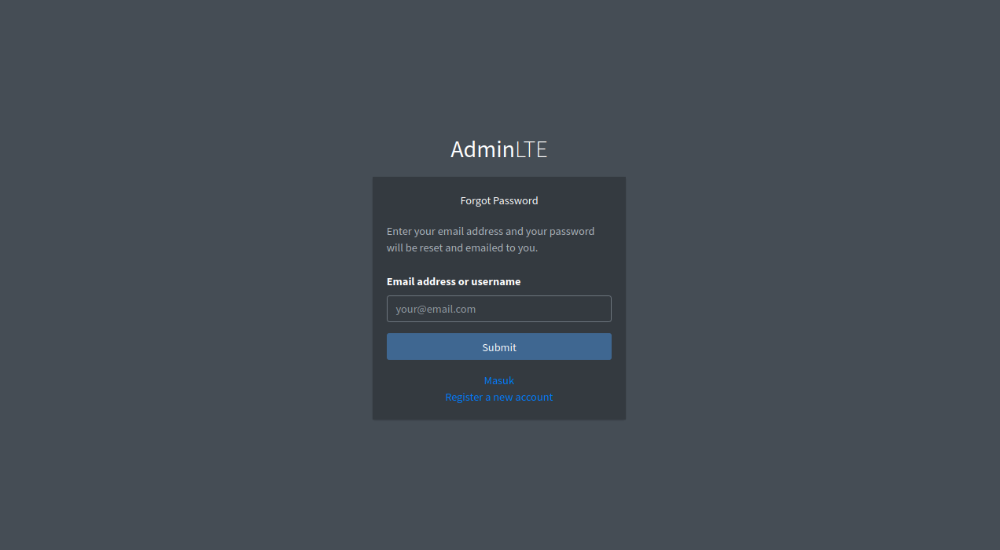

# Introduction

This is a full web app using [Starlette][Starlette].

This project exists with the help of some of really great tools.

- [Starlette][Starlette]: Lightweight ASGI framework/toolkit 
  for building async web services
- [Tabler][Tabler]: UI kit based on Bootstrap 5
- [SQLAlchemy][SQLAlchemy]: The Python SQL Toolkit and Object Relational Mapper
- [Arq][arq]: Job queues and RPC in python with asyncio and redis
- [SQLAdmin][SQLAdmin]: Admin interface for SQLAlchemy models
- [Authlib][authlib]: The ultimate Python library in building OAuth and OpenID Connect servers
- _And more..._

## Screenshots

<details>
<summary>Home Page</summary>


</details>

<details>
<summary>Login Page</summary>


</details>

<details>
<summary>Register Page</summary>


</details>

<details>
<summary>Forgot Password Page</summary>



</details>

<details>
<summary>User Profile Setting Page</summary>


</details>


# Setup

## Requirements

- Python: at least version 3.10
- Database: SQLite, MySQL, PostgresQL or anything that is supported by 
  [SQLAlchemy][SQLAlchemy]
- Redis
- SMTP
- OAuth2 (GitHub and Google)


## Application Configuration

Application configuration is required as on `.env.example`.
You can copy this file as `.env` and edit it as you want.

```shell
cp .env.example .env
```

## Database

### Create Tables

```bash
# Initial alembic
alembic revision --autogenerate -m 'initial'
alembic upgrade head
```

## Redis

Redis is required for [`arq`][arq] for 
job queues and RPC in python with asyncio and redis.

## SMTP

Upon **registration**, **password update**, **reset password** action,
you need to open links that sent to your email.

White starting this web application, 
you can use a really cool **fake SMTP** service that provided by 
[Ethereal Email][ethereal].

For production use, you may edit the SMTP configuration on the `.env` file
for any SMTP service you like.

## Admin User

On first startup, an `admin` user is created.
The credentials should be placed on `.env` file.

Admin configuration example on `.env` file

```text
ADMIN_USERNAME=admin
ADMIN_PASSWORD=password
ADMIN_EMAIL='admin@localhost'
```

## OAuth2

This web app is extended to use third party Oauth2 provider such as *Google* and *GitHub*.
We need to set up OAuth2 configuration one `.env`.

```text
GITHUB_CLIENT_ID=
GITHUB_CLIENT_SECRET=
GOOGLE_CLIENT_ID=
GOOGLE_CLIENT_SECRET=
```

Please make sure to set the scopes for the OAuth2 clients for at least to be able to see `email` and public profile. 


# Run Locally (Development Mode)

## Change 'ENV' value on `.env`

```text
ENV=dev
```

## Web Application Service

```shell
bash scripts/dev.sh
```

## Arq (Job Queueing and Processing)

```shell
bash scripts/arq.sh
```

# Run In Production

For production use, make sure you edit the `.env` configuration file, such as.
Make sure you use proper value for `SECRET_KEY` and admin user credentials.

```text
ENV=prod
SECRET_KEY=CHANGE THIS SECRET

ADMIN_USERNAME=admin
ADMIN_PASSWORD=password
ADMIN_EMAIL='admin@localhost'
```

Then make sure you use a real SMTP Provided and edit the SMTP configuration.

## Web Application Service

```shell
bash scripts/prod.sh
```

## Arq (Job Queueing and Processing)

```shell
bash scripts/arq.sh
```

## KIll the services

```shell
kill `cat files/pids/web_app.pid`
```

## Nginx

Please take a look on `configs/nginx_conf_d_yousite.conf`.
Copy that file and edit on `/etc/nginx/conf.d/yoursite_com.conf`.

## SSL Certificate

Please consider to create a free SSH Certificate you your web app. :)

[Letsencrypt][Letsencrypt] will help you to run your web application to this.

# Test

## Install Test Packages

```shell
pip install -r requirements/test.txt
```

## Run Test

```shell
pytest
```


[arq]: https://arq-docs.helpmanual.io
[arq-dashboard]: https://github.com/ninoseki/arq-dashboard
[authlib]: https://authlib.org
[ethereal]: https://ethereal.email
[Letsencrypt]: https://letsencrypt.org
[SQLAdmin]: https://aminalaee.dev/sqladmin
[SQLAlchemy]: https://docs.sqlalchemy.org/en/20/
[Starlette]: https://www.starlette.io
[Tabler]: https://tabler.io
